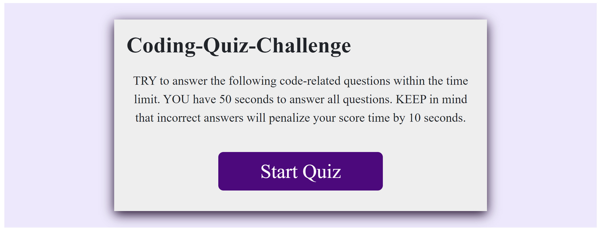
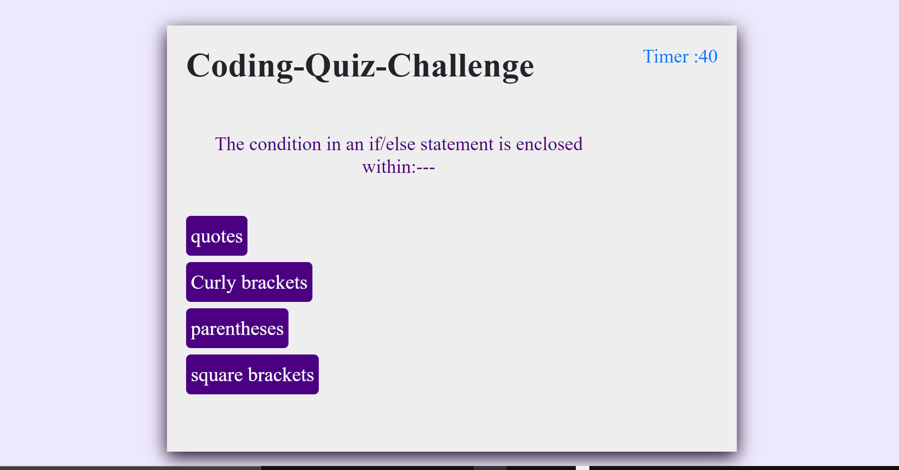
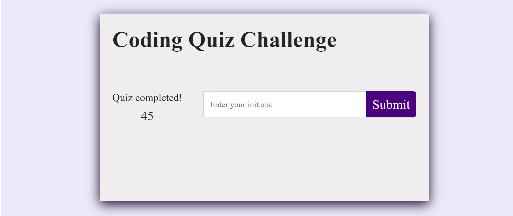
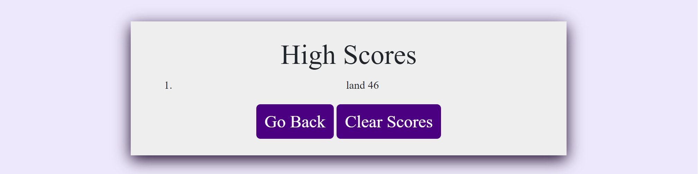

# Quiz-Challenge-With-Timer

This application is built with 5 coding-related questions, user is to answer the questions within the time limit. Included following features:
    + WHEN clicking the start button
    + THEN a timer starts and I am presented with a question
    + WHEN answering a question
    + THEN another question presented
    + WHEN answering a question incorrectly
    + THEN time is subtracted from the clock
    + WHEN all questions are answered or the timer reaches 0
    + THEN the game is over
    + WHEN the game is over
    + THEN I can save my initials and my score

# HTML file using bootstrap
CREATED 2 seperate files:
    + index.html included: 
        - Landing Page 
        - Quiz Page with h1 tag giving an alert "correct" or "wrong" when the answers are answered. The questions and choices are coded by JavaScript. 
        - Submit Page where user can enter initials and save the score.
    + score.html:
        - Has a container where highScores are displayed
        - Button Go Back
        - Button Clear Scores.

# JavaScripts
There are 2 seperate files:
    + script.js : handle rendering questions and answers of quiz game and the submit the score
    + score.js : handle saving and clearing highScores with localStorage.

# Mock up

# GitHub page
https://github.com/Scorpion-rep/Quiz-Challenge-With-Timer

# Deployed page
https://scorpion-rep.github.io/Quiz-Challenge-With-Timer/

